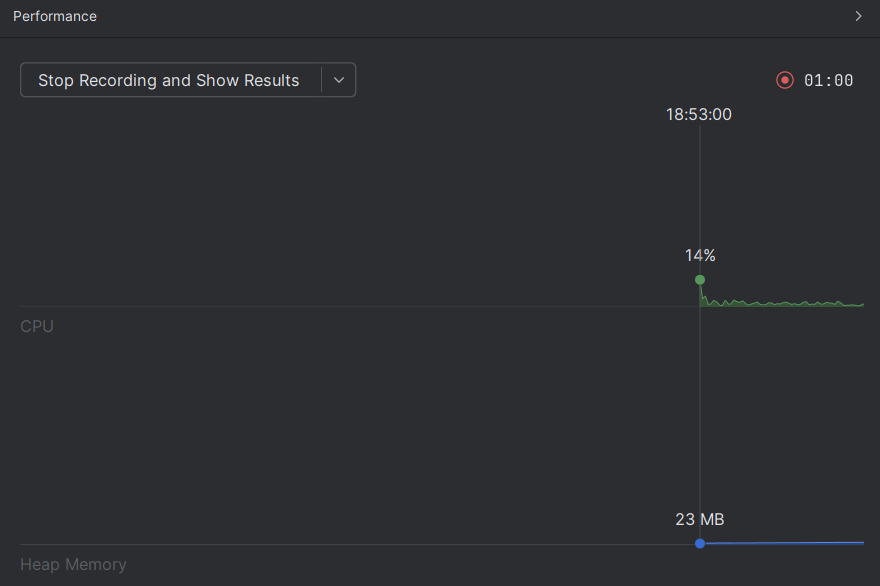
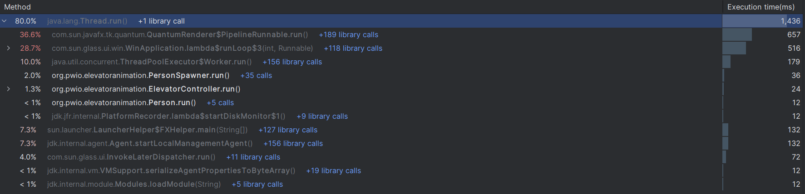
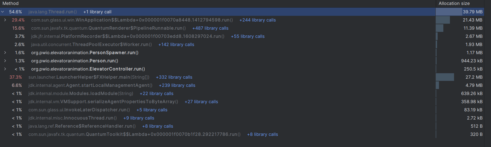
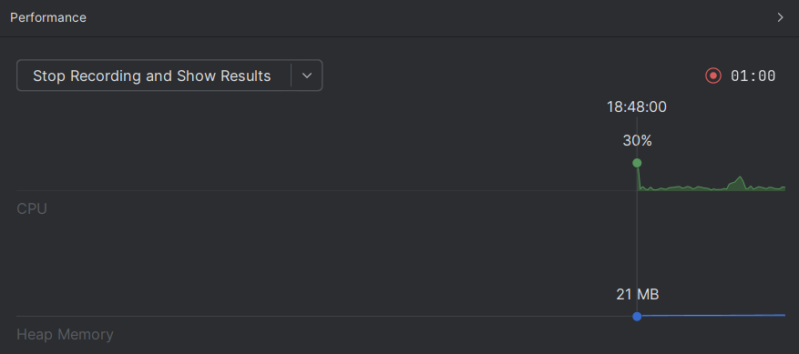
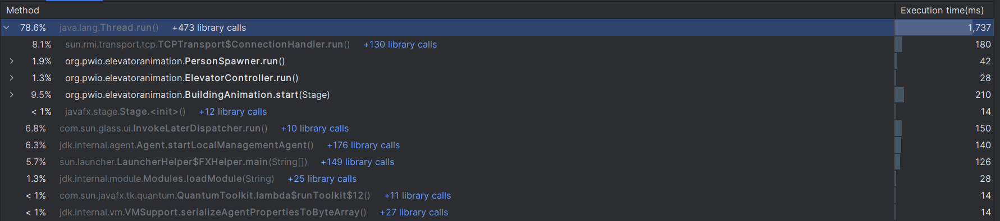
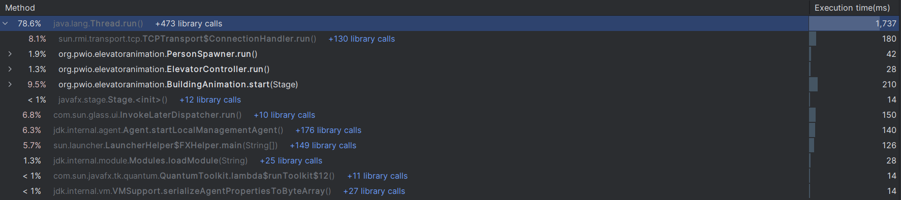

# ElevatorMultiThreading

Program wielowątkowy symulujący działanie windy w pięcio-poziomowym budynku.
Animacja wykonana za pomocą JavaFX

Istnieje jeden wątek dla windy, i tworzone są w trakcie działania kolejne wątki symulujące ludzi/pasażerów.
Wątki są odpalane przez Thread.start lub ExecutorService.

Winda obsługuje pasażerów w kolejności jej zamówienia (ale 'zbiera' też pasażerów jadących w tą samą stronę w którą winda i tak jedzie).
Algorytm windy nie jest nadmiernie skomplikowany ponieważ skupiono się na obsłudze wielu wątków.

## Profiler - Thread vs ExecutorService

### Thread:

### ExecutorService:

